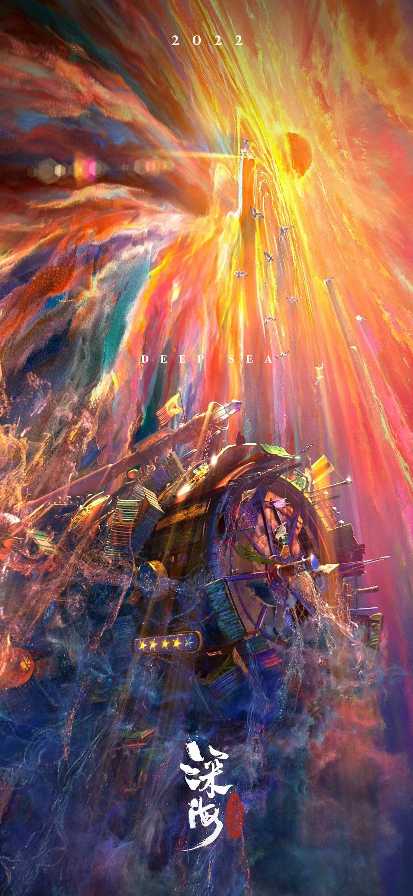

Week 8

- PART I

Inspired by the particle ink effect depicted in the animated film "Deep Sea," where ink particles move in water, creating captivating colors and visual spectacles, I intend to integrate this mesmerizing particle ink effect into my project. By simulating the dynamic flow and interaction of these ink-like particles, I aim to enrich my project's visual allure and immersion. This approach will offer users a distinctive and interactive experience within the virtual environment, bridging the gap between artistry and interactivity, and aligning perfectly with the project's requirements.

- PART II

This coding technique employs Perlin noise and a particle system to simulate the flow effect.
  - Perlin Noise: By utilizing Perlin noise to calculate angles for each point in the flow field, the code generates natural and organic motion, enhancing the realism of the flow field.
  - Particle System: By creating a multitude of particles and guiding their movement based on the flow field, particles move along the direction indicated by the flow field, creating a sense of fluid motion.
  - Color and Stroke Control: The code's variables allow for adjustments to color, brightness, saturation, and stroke properties, enabling changes in lighting and color variation.

[p5.js of PerlinNoiseFlowFieldColorsrandomall](https://editor.p5js.org/StevesMakerspace/sketches/pJMo9fwPU)

[p5.js of RainbowRain](https://editor.p5js.org/StevesMakerspace/sketches/erSVBQnr)

[tutorial of Perlin Noise Flow Field](https://thecodingtrain.com/challenges/24-perlin-noise-flow-field)